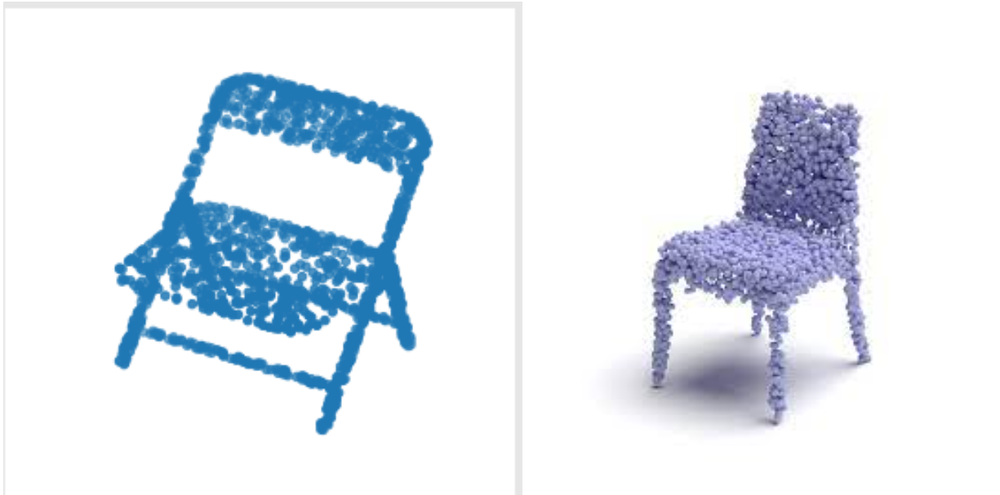

# PLACKY

Point Clouds of 2 objects can be used to find similarity by calculating average distance of each point of 1 object with another object.

Problem we have: To find similarity between two given 3-Dimensional Objects.

Possible Approaches for the given problem:

1. Using **Point Clouds** for calculating similarity between 2 objects.
    
    Problem with the above approach :
    
    It can not handle scaling, rotation and distortions well.
    
    
    
    
    
2. Converting 3 Dimensional objects into 2 Dimensional projections.

We can convert 3D objects into a set of 2D images for both the objects. We can then use distance metrics to calculate distance or similarity between images and hence the 3D models.

LETS DISCUS THIS APPROACH:

1. Pre-processing: To make sure that the 2D projections that we take carry information and variance of the model, we needed to make sure that they would always fit the camera-frame. Hence we employed a standardization technique in which we centroid-normalised all the points of the 3D Object. This is analogous to mean normalisation that we generally see in common machine learning models.
2. Effect of Rotation and Scaling: Rotation do not has any effect on the model as we take projections on 3 dimensions i.e 6 viewpoints. The algorithms used in our method can handle well skewnesss and distortions and flawlessly find similarities.
    
    
    

**HOW WE’RE CALCULATING SIMILARITY BETWEEN TWO IMAGES?**

We tried two different approaches for finding the similarity between 2 images.

1. COSINE SIMILARITY:
    
    We calculated cosine difference of each image with another. We used tensorflow’s implementation of Cosine difference, but it did not gave satisfactory results. It is one of the basic and naive approaches for finding similarity between images, texts and other file types. But for our task we needed a algorithm that could handle skewness and rotation without demanding additional features.11
    

1. NEAREST NEIGHBOURS:
    
    Scale Invariant Feature Transform (SIFT) and Speeded-Up Robust Features (SURF) are usually compared and matched using the Euclidean distance (or L2-norm). Alternatives of the Euclidean distance are histogram-based metrics ( χ2).
    
    Flann stands for Fast Library for Approximate Nearest Neighbors. It is actually used for the system to choose the best algorithm and optimum parameters depending on the dataset.
    
    It uses **Nearest Neighbors**
    Both **Randomized k-d Tree**
    and **Priority-based K-Means**
    are efficient approximate nearest neighbor search algorithms that can be used in FLANN